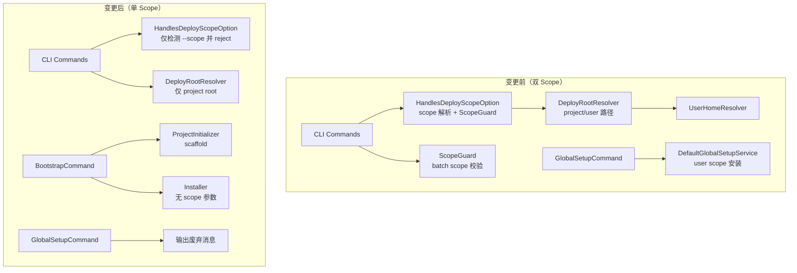

# Design Document: Deprecate Scope

## Overview

本设计文档定义"废弃 Scope"功能的技术方案。核心目标是移除 `user` scope 概念与 `--scope` 参数，将系统从双 scope 模型简化为仅 project scope 模型，同时扩展 `bootstrap` 命令以承接原 `global-setup` 的 ability 安装职责。

### 设计原则

1. **Fail-Fast 语义**：所有遗留字段/参数在解析阶段即终止，不进入业务逻辑
2. **最小侵入**：保留 `DeployScope` 枚举和 `DeployRootResolver` 类骨架，维持类型安全与可测试性
3. **逐项容错**：`bootstrap` ability 安装沿用现有 `Installer` 逐项模式，单项失败不阻塞剩余
4. **前置校验**：`bootstrap.includes` 引用不存在的 ability 时 fail-fast 拒绝执行

### 变更范围

```
删除文件: UserHomeResolver.php, ScopeGuard.php, DefaultGlobalSetupService.php, GlobalSetupService.php
重写文件: HandlesDeployScopeOption.php, DeployRootResolver.php, DeployScope.php,
         AbilityRegistry.php, AbilityEntry.php, InvalidScopeException.php,
         Installer.php, InstallationProbe.php, CheckService.php,
         ShowStatusPresenter.php, AbilityUpdateService.php,
         BootstrapCommand.php, GlobalSetupCommand.php, CleanupCommand.php,
         ShowCommand.php, UpdateCommand.php
```

---

## Architecture

### 变更前后对比



### 关键架构决策

| 决策点 | 方案 | 理由 |
|--------|------|------|
| `--scope` 检测位置 | 各命令 `handle()` 顶部（RD-1） | 复用现有 trait 模式，代码集中，变更最小 |
| 违规错误消息 | 同一异常类 + 不同 factory method（RD-2） | 保持异常体系统一，各消息含具体迁移建议 |
| `bootstrap.includes` 无效引用 | 前置校验 fail-fast（RD-3） | 避免部分安装后发现引用无效，减少用户困惑 |
| `DeployRootResolver` 保留 | 构造函数注入 root path（RD-4） | 维持可测试性，测试时注入 fixture 路径 |

---

## Components and Interfaces

### 1. DeployScope（枚举简化）

```php
// src/Config/DeployScope.php
enum DeployScope: string
{
    case Project = 'project';
    // User case 已移除
}
```

### 2. DeployRootResolver（简化）

```php
// src/Service/DeployRootResolver.php
final class DeployRootResolver
{
    public function __construct(
        private readonly ?string $rootPath = null,  // null 时使用 getcwd()
    ) {}

    /** 返回 project root（注入值或 getcwd()） */
    public function resolve(): string;

    /** 拼接绝对路径：resolve() + relativeTarget */
    public function absoluteTargetPath(string $relativeTarget): string;
}
```

**移除的方法**：`parseScopeOption()`、`resolve(DeployScope)`（不再接受 scope 参数）

### 3. InvalidScopeException（重构 factory methods）

```php
// src/Service/InvalidScopeException.php
final class InvalidScopeException extends \InvalidArgumentException
{
    /** --scope 参数废弃消息 */
    public static function scopeOptionDeprecated(): self;

    /** global-setup 命令废弃消息 */
    public static function globalSetupDeprecated(): self;

    /** abilities.yaml 遗留 scopes 字段 */
    public static function legacyScopesField(string $entryPath): self;

    /** abilities.yaml 遗留 global-setup key */
    public static function legacyGlobalSetupKey(): self;
}
```

**移除的方法**：`unknownScope()`、`projectOnlyInUserScope()`

### 4. HandlesDeployScopeOption（trait 重构）

```php
// src/Command/HandlesDeployScopeOption.php
trait HandlesDeployScopeOption
{
    /** 注册 --scope 选项（保持 CLI 签名兼容性以便检测） */
    protected function configureDeployScopeOption(): void;

    /**
     * 检测 --scope 是否被传入，若有则抛出废弃异常。
     * 在各命令 handle() 顶部调用。
     *
     * @throws InvalidScopeException 当 --scope 有任何值时
     * @return void（正常执行时 --scope 未传入，静默通过）
     */
    protected function rejectIfScopeOptionPresent(InputInterface $input): void;
}
```

**移除的方法**：`resolveDeployScopeOption()`、`guardInstallBatch()`、`guardPresetInstall()`

### 5. AbilityEntry（移除 scopes 属性）

```php
// src/Service/AbilityEntry.php
final readonly class AbilityEntry
{
    public function __construct(
        public string $path,
        public string $description,
        public array $targets,   // array<string, string>
        public string $type,
        // $scopes 属性已移除
    ) {}
}
```

### 6. AbilityRegistry（格式变更）

```php
// src/Service/AbilityRegistry.php
final class AbilityRegistry
{
    /**
     * 解析 abilities.yaml。
     * - 遇到任何 entry 含 scopes 字段 → 抛 InvalidScopeException::legacyScopesField()
     * - 遇到 global-setup 顶层 key → 抛 InvalidScopeException::legacyGlobalSetupKey()
     * - 以上为 fail-fast，首个违规即终止
     *
     * @return array{rules: list<AbilityEntry>, agents: list<AbilityEntry>, skills: list<AbilityEntry>, hooks: list<AbilityEntry>, gitignore: list<array>, presets: list<array>, prompts: list<array>}
     * @throws InvalidScopeException
     * @throws AbilityRegistryException
     */
    public function parse(): array;

    /**
     * 读取 bootstrap.includes 列表。
     * 从 bootstrap section 的 includes 字段解析 type:path 条目。
     * bootstrap section 不存在或 includes 为空时返回空数组。
     *
     * @return list<array{type: string, path: string}>
     */
    public function bootstrapIncludes(): array;

    /**
     * 校验 bootstrap.includes 中所有引用在 registry 中存在。
     * 任一引用不存在则抛出异常（fail-fast）。
     *
     * @param list<array{type: string, path: string}> $includes
     * @throws AbilityRegistryException 当引用的 ability 不存在时
     */
    public function validateBootstrapIncludes(array $includes): void;
}
```

**移除的方法**：`globalSetupIncludes()`、`projectOnlyPaths()`、`resolveScopes()`

### 7. InstallationProbe（移除 scope 参数）

```php
// src/Service/InstallationProbe.php
final class InstallationProbe
{
    public function __construct(
        private readonly AbilityRegistry $registry,
        private readonly DeployRootResolver $rootResolver,
    ) {}

    /** 探测 ability 是否已安装（仅 project scope） */
    public function isPresent(string $type, string $name, string $target): bool;
}
```

### 8. Installer（移除 scope 参数）

```php
// src/Service/Installer.php
final class Installer
{
    /**
     * @param array{skills: list<string>, rules: list<string>, agents: list<string>, hooks?: list<string>, prompts?: list<string>} $items
     * @param array<int, string> $targets
     * @return array{lines: array<int, string>, exit_code: int}
     */
    public function installTyped(
        array $items,
        array $targets,
        ?string $presetName = null,
        bool $skipExisting = false,  // bootstrap 场景：已安装则跳过
    ): array;

    /**
     * @return array{lines: array<int, string>, exit_code: int}
     */
    public function uninstallTyped(
        array $items,
        array $targets,
        bool $force = false,
    ): array;

    /** 遍历 registry 卸载 project scope 已安装 ability */
    public function uninstallProjectScope(): array;
}
```

**移除的参数**：所有方法的 `DeployScope $scope` 参数

### 9. CheckService（移除 scope 方法）

```php
// src/Service/CheckService.php
final class CheckService
{
    public function __construct(
        private readonly ComposerBaselineResolver $baselineResolver,
        private readonly ?AbilityDiffService $diffService = null,
        private readonly HookChecker $hookChecker = new HookChecker(),
        private readonly DeployRootResolver $rootResolver = new DeployRootResolver(),
    ) {}

    /**
     * 检查 project scope 下 ability 安装状态。
     * 
     * @param array{skills: list<string>, rules: list<string>, agents: list<string>, hooks?: list<string>} $items
     * @param array<int, string> $targets
     * @return array<int, array{type: string, name: string, target: string, status: string}>
     */
    public function checkTyped(array $items, array $targets): array;

    /** 评估退出码：存在 modified/missing/no-baseline → 2 */
    public function evaluateExitCode(array $results): int;

    /** 渲染结果行 */
    public function renderResults(array $results): array;

    /** 是否存在 modified 项 */
    public function hasModified(array $results): bool;
}
```

**移除的方法**：`checkTypedForScope()`

### 10. ShowStatusPresenter（简化）

```php
// src/Service/ShowStatusPresenter.php
final class ShowStatusPresenter
{
    public function __construct(
        private readonly AbilityRegistry $registry,
        private readonly CheckService $checkService,
        private readonly InstallationProbe $probe,
        private readonly string $packageRoot,
        private readonly DeployRootResolver $rootResolver = new DeployRootResolver(),
        private readonly GitIgnoreTemplateService $gitIgnore = new GitIgnoreTemplateService(),
    ) {}

    /**
     * 仅评估 project scope，返回行列表。
     * 输出格式: {type}:{name}  {status}   {targets}
     * 无 scope 标签、无 dual-scope 警告。
     *
     * @param array<int, string> $targets
     * @return list<string>
     */
    public function lines(array $targets, ?string $typeFilter): array;
}
```

**移除的参数**：`?DeployScope $scopeFilter`
**移除的逻辑**：user+project 合并展示、`dualScopeWarning`、`scopeLabel`

### 11. AbilityUpdateService（简化）

```php
// src/Service/AbilityUpdateService.php
class AbilityUpdateService
{
    /**
     * 仅遍历 project scope 已安装 ability。
     * 输出格式: changed: {type}:{name} {target}（无 scope 标签）
     *
     * @return array{lines: list<string>, exit_code: int}
     */
    public function reportChanges(bool $force): array;
}
```

**移除的逻辑**：`DeployScope::User` 遍历循环、输出中的 `({scope})` 标签

### 12. BootstrapCommand（扩展）

```php
// src/Command/BootstrapCommand.php
final class BootstrapCommand extends Command
{
    public function __construct(
        private readonly ?ProjectInitializer $initializer = null,
        private readonly ?AbilityRegistry $registry = null,
        private readonly ?Installer $installer = null,
    ) {
        parent::__construct();
    }

    /**
     * 执行流程：
     * 1. scaffold（ProjectInitializer::init()）
     * 2. 读取 bootstrap.includes
     * 3. validateBootstrapIncludes() — fail-fast
     * 4. 逐项安装到 project scope
     *    - 已安装无 --force → [skip]
     *    - 已安装有 --force → 覆盖
     *    - 安装失败 → [fail]，继续剩余
     * 5. 全部成功(含 skip) → exit 0；存在 fail → exit 1
     */
    protected function execute(InputInterface $input, OutputInterface $output): int;
}
```

### 13. GlobalSetupCommand（废弃壳）

```php
// src/Command/GlobalSetupCommand.php
final class GlobalSetupCommand extends Command
{
    // 不再注入 GlobalSetupService
    public function __construct() { parent::__construct(); }

    protected function execute(InputInterface $input, OutputInterface $output): int
    {
        // 输出废弃消息（含命令名 + 替代命令），exit FAILURE
        // 不写文件、不创目录、不发网络请求
    }
}
```

### 14. CleanupCommand（文案清理）

现有逻辑不变，仅移除成功提示中的 "user-scope global-setup is unchanged" 文案，改为：

```
To reinstall project abilities, run /apm init.
```

### 15. ShowCommand（移除 --scope 选项）

```php
// src/Command/ShowCommand.php
final class ShowCommand extends Command
{
    use HandlesDeployScopeOption;

    protected function configure(): void
    {
        // 保留 --scope 选项定义（用于检测）
        $this->configureDeployScopeOption();
        // --target, --type 保持不变
    }

    protected function execute(InputInterface $input, OutputInterface $output): int
    {
        // 1. rejectIfScopeOptionPresent($input) — 若有 --scope 立即报错
        // 2. 调用 presenter->lines($targets, $typeFilter)
    }
}
```

### 16. UpdateCommand（移除 scope 遍历）

```php
// src/Command/UpdateCommand.php
final class UpdateCommand extends Command
{
    // 不再使用 HandlesDeployScopeOption（update 本身无 --scope 选项）
    // updateService->reportChanges() 仅遍历 project scope
}
```

---

## Data Models

### abilities.yaml 格式变更

**变更前**：

```yaml
version: "1"
global-setup:
  includes:
    - skill:apm
    - rule:git:git-conventions
rules:
  - path: git:git-conventions
    description: Git 提交规范
    targets: { cursor: ..., kiro: ... }
    scopes: [project, user]
```

**变更后**：

```yaml
version: "1"
bootstrap:
  includes:
    - skill:apm
    - rule:git:git-conventions
rules:
  - path: git:git-conventions
    description: Git 提交规范
    targets: { cursor: ..., kiro: ... }
    # scopes 字段已移除，所有 entry 隐式为 project-only
```

### 验证规则

| 条件 | 行为 |
|------|------|
| 任何 entry 含 `scopes` 字段 | `InvalidScopeException::legacyScopesField($path)` — fail-fast |
| 存在 `global-setup` 顶层 key | `InvalidScopeException::legacyGlobalSetupKey()` — fail-fast |
| `bootstrap` section 不存在 | 正常，`bootstrapIncludes()` 返回 `[]` |
| `bootstrap.includes` 为空数组 | 正常，返回 `[]` |
| `bootstrap.includes` 引用不存在的 ability | `AbilityRegistryException` — fail-fast（前置校验） |

### ShowAbilityRow（简化）

```php
final readonly class ShowAbilityRow
{
    public function __construct(
        public string $type,
        public string $name,
        public string $status,     // not installed | installed | installed with local change
        public string $targetsText,
        // scopeLabel 和 dualScopeWarning 已移除
    ) {}

    /** 格式: {type}:{name}  {status}   {targets} */
    public function formatLine(): string;
}
```

---

## Correctness Properties

*A property is a characteristic or behavior that should hold true across all valid executions of a system—essentially, a formal statement about what the system should do. Properties serve as the bridge between human-readable specifications and machine-verifiable correctness guarantees.*

### Property 1: --scope 参数全面拒绝

*For any* command that uses `HandlesDeployScopeOption` trait, and *for any* string value passed as `--scope` (including "project", "user", empty string, arbitrary text), the command SHALL reject with a deprecation error containing both removal notice and project-only guidance, and SHALL NOT execute any business logic.

**Validates: Requirements 1.1, 1.2, 1.3, 1.4, 1.5, 1.6**

### Property 2: Bootstrap includes 解析正确性

*For any* valid `abilities.yaml` containing a `bootstrap.includes` list with well-formed `type:path` entries, `AbilityRegistry::bootstrapIncludes()` SHALL return a list where each element's `type` and `path` match the original YAML content exactly (round-trip preservation of semantics).

**Validates: Requirements 4.3**

### Property 3: Bootstrap 幂等性

*For any* ability in `bootstrap.includes` that is already installed on disk at the target path, executing `bootstrap` without `--force` SHALL skip that ability (output contains `[skip]`), and executing `bootstrap` with `--force` SHALL overwrite it. In both cases the final disk state for that ability SHALL be valid.

**Validates: Requirements 3.3, 3.4**

### Property 4: Bootstrap 部分失败容错

*For any* `bootstrap.includes` list containing N items where item K (1 ≤ K ≤ N) fails installation, all items at positions ≠ K SHALL still be attempted, and the scaffold SHALL remain intact on disk.

**Validates: Requirements 3.5, 3.7**

### Property 5: 遗留字段 fail-fast 终止

*For any* `abilities.yaml` containing one or more legacy violations (a `scopes` field on any entry, or a `global-setup` top-level key), `AbilityRegistry::parse()` SHALL throw an exception on the *first* violation encountered and SHALL NOT process any subsequent entries or violations.

**Validates: Requirements 4.1, 4.2, 4.5**

### Property 6: Show 输出无 scope 标记

*For any* set of registered abilities (installed or not), the output of `show` command SHALL contain only lines in format `{type}:{name}  {status}   {targets}` with no scope labels (`(user)`, `(project)`, `(user+project)`) and no dual-scope warning text.

**Validates: Requirements 5.1, 5.2, 5.3**

### Property 7: Show type 过滤器正确性

*For any* valid `--type` filter value and *for any* registry content, all lines in `show` output SHALL have a type prefix matching the filter value, and no lines with a different type SHALL appear.

**Validates: Requirements 5.4**

### Property 8: Update 仅遍历 project scope

*For any* set of installed abilities, `AbilityUpdateService::reportChanges()` SHALL only check abilities present in project scope (via `DeployRootResolver::resolve()` as workspace root), and SHALL NOT attempt to resolve or check user home directory paths.

**Validates: Requirements 6.1, 6.2**

### Property 9: Update 输出格式无 scope 标签

*For any* ability detected as changed by `update`, the output line SHALL match format `changed: {type}:{name} {target}` without any parenthesized scope label.

**Validates: Requirements 6.3**

### Property 10: Cleanup 输出无遗留用语

*For any* execution of `cleanup` command (success or failure), the complete output SHALL NOT contain the strings "user-scope", "user scope", or "global-setup".

**Validates: Requirements 7.1**

---

## Error Handling

### 异常层次

```
InvalidArgumentException
 └── InvalidScopeException
       ├── ::scopeOptionDeprecated()
       │     消息: "The --scope option has been removed. All operations now target project scope only."
       ├── ::globalSetupDeprecated()
       │     消息: "The global-setup command has been removed. Use 'apm bootstrap' instead."
       ├── ::legacyScopesField(string $path)
       │     消息: "Legacy 'scopes' field found on entry '{$path}'. Remove the scopes field — all entries are now project-only."
       └── ::legacyGlobalSetupKey()
             消息: "Legacy 'global-setup' key found. Rename to 'bootstrap'."

RuntimeException
 └── AbilityRegistryException
       └── ::invalidBootstrapReference(string $type, string $path)
             消息: "bootstrap.includes references non-existent {$type} '{$path}'. Fix abilities.yaml before running bootstrap."
```

### 错误处理策略

| 场景 | 处理方式 | 退出码 |
|------|----------|--------|
| `--scope` 传入任何值 | 输出废弃消息到 stderr，立即 return FAILURE | 1 |
| `global-setup` 命令执行 | 输出废弃消息到 stderr，return FAILURE | 1 |
| `abilities.yaml` 含 `scopes` 字段 | 抛 `InvalidScopeException`，调用方捕获输出 | 1 |
| `abilities.yaml` 含 `global-setup` key | 抛 `InvalidScopeException`，调用方捕获输出 | 1 |
| `bootstrap.includes` 引用无效 ability | 抛 `AbilityRegistryException`，bootstrap 中止 | 1 |
| bootstrap 单项安装失败 | 输出 `[fail]`，继续剩余，最终 exit 1 | 1 |
| bootstrap scaffold 目标已存在无 --force | 抛异常，整体中止 | 1 |
| `DeployRootResolver` getcwd() 失败 | 抛 `RuntimeException` | 1 |

### 边界条件

- `bootstrap.includes` 为空列表：仅 scaffold，exit 0
- `bootstrap` section 缺失：等同空列表，仅 scaffold，exit 0
- `--scope` 后跟其他有效参数：先检测 `--scope` 即报错，不处理其他参数
- `cleanup` 全部成功时：输出 `/apm init` 引导提示
- `cleanup` 有失败时：不输出引导提示

---

## Testing Strategy

### 测试框架

- **单元测试**：PHPUnit 13
- **Property-based testing**：PHPUnit + [eris/eris](https://github.com/giorgiosironi/eris)（PHP PBT 库）
- **E2E 测试**：通过 `bin/apm` 入口执行完整命令验证

### Property-Based Tests（最少 100 次迭代）

每个 correctness property 对应一个 PBT 测试用例：

| Property | 测试要点 | 生成策略 |
|----------|----------|----------|
| 1: --scope 拒绝 | 随机字符串作为 scope 值 | `Generator\string()` 含 "project"、"user"、空串、随机 |
| 2: bootstrap includes 解析 | 随机 type:path 组合 | type ∈ {skill,rule,agent,hook}, path = alphanumeric + `:` |
| 3: 幂等性 | 预装/未装 × force/no-force 组合 | bool × ability list |
| 4: 部分失败 | 随机失败位置 | 长度 1-10 列表 + 随机失败位 |
| 5: fail-fast | 随机违规位置 | YAML 含 1-N 个 scopes 字段，验证仅首个报错 |
| 6: show 无 scope | 随机 registry 内容 | 0-20 个 ability entries |
| 7: show 过滤 | 随机 type 过滤 | type ∈ KNOWN_TYPES |
| 8: update project-only | 随机安装状态 | ability × installed/not × changed/unchanged |
| 9: update 格式 | 随机 changed 项 | type:name × target 组合 |
| 10: cleanup 无遗留 | 随机卸载结果 | success/failure 场景 |

**标签格式**：`Feature: deprecate-scope, Property {N}: {title}`

### Unit Tests（Example-Based）

| 测试场景 | 归属 Requirement |
|----------|-----------------|
| global-setup 命令输出含命令名和替代命令 | 2.1, 2.2 |
| global-setup 命令不写文件 | 2.3 |
| bootstrap scaffold 先于 ability install | 3.1 |
| bootstrap 空 includes exit 0 | 3.8 |
| bootstrap 全部成功 exit 0 | 3.9 |
| abilities.yaml global-setup key 报错 | 4.2 |
| bootstrap section 缺失返回空 | 4.4 |
| show 空 registry exit 0 | 5.5 |
| cleanup 成功时输出 init 引导 | 7.2 |
| cleanup 失败时不输出引导 | 7.3 |

### Integration / Smoke Tests

| 测试场景 | 归属 Requirement |
|----------|-----------------|
| 源码无 UserHomeResolver 引用 | 8.1 |
| 源码无 ScopeGuard 引用 | 8.2 |
| 源码无 DefaultGlobalSetupService/GlobalSetupService 引用 | 8.3 |
| DeployRootResolver 无 DeployScope 参数 | 8.4 |
| InstallationProbe/Installer 无 $scope 参数 | 8.5 |
| CheckService 无 checkTypedForScope 方法 | 8.6 |
| AbilityEntry 无 $scopes 属性 | 8.10 |
| DeployScope 仅含 Project case | 8.11 |
| 文档无遗留 scope 引用 | 9.7 |

### 配置要求

- PBT 最少 100 次迭代
- 每个 property test 注释标签：`Feature: deprecate-scope, Property {N}: {title}`
- PHPStan level 8 通过
- 全量测试覆盖率 ≥ 现有水平

---

## Impact Analysis

### 受影响命令

| 命令 | 变更类型 | 影响 |
|------|----------|------|
| `install` / `add` | 移除 --scope 解析，移除 ScopeGuard 调用 | 仅 project 安装 |
| `skill:install` / `rule:install` / `agent:install` | 同上 | 同上 |
| `skill:uninstall` / `rule:uninstall` / `agent:uninstall` / `preset:uninstall` | 同上 | 同上 |
| `show` | 移除 --scope 过滤、移除双 scope 合并 | 仅 project 状态 |
| `update` | 移除 user scope 遍历 | 仅 project 差异 |
| `cleanup` | 文案修改 | 无逻辑变更 |
| `bootstrap` | 新增 ability 安装阶段 | 功能扩展 |
| `global-setup` | 改为废弃壳 | 不再执行安装 |
| `check` / `skill:check` 等 | 内部 CheckService 签名变更 | 行为不变（原本即 project） |

### 受影响文档

| 文档 | 变更类型 |
|------|----------|
| `docs/state/deploy-scope.md` | 重写（移除 user scope 全部内容） |
| `docs/state/cli-commands.md` | 移除 --scope 参数、标注 global-setup 废弃 |
| `docs/state/abilities-model.md` | 移除 scopes 字段文档 |
| `docs/state/install-behavior.md` | 移除 user scope 路径解析内容 |
| `docs/manual/usage.md` | 三阶段改两阶段首装 |
| `**/init-workflow.md`（cursor + kiro） | 移除 global-setup 引用 |

### 向后兼容性

- **破坏性变更**：`--scope` 参数和 `global-setup` 命令立即失败（无 shim）
- **abilities.yaml**：含 `scopes` 或 `global-setup` 的旧格式文件会 fail-fast
- **迁移路径**：
  1. 移除 `abilities.yaml` 中所有 `scopes` 字段
  2. 将 `global-setup` section 改名为 `bootstrap`
  3. 使用 `apm bootstrap` 替代 `apm global-setup`

---

## Alternatives Considered

### 方案 A：向后兼容 Shim

`--scope project` 静默通过，仅 `--scope user` 报错。

**否决原因**：增加隐含行为，用户可能误认为 scope 仍生效；goal 明确要求一律 hard fail。

### 方案 B：删除 DeployRootResolver

所有调用方直接使用 `getcwd()`，消除间接层。

**否决原因**：丧失可测试性，无法在测试中注入 fixture 路径。保留类 + 构造函数注入是更好的折中。

### 方案 C：渐进废弃（warning → error）

先输出 deprecation warning 保持功能，后续版本再 hard fail。

**否决原因**：goal 明确要求即时废弃，不做渐进策略；user scope 实际无人使用，无需过渡期。

### 方案 D：bootstrap.includes 失败项 warn-and-skip

无效引用仅输出 `[warn]` 跳过，不计入失败。

**否决原因**：可能导致用户不知道拼写错误，错误的 ability 列表默默通过。fail-fast 更符合"尽早发现问题"原则。

### 方案 E：Application 层全局拦截 --scope

在 Symfony Console Application 注册 `ConsoleEvents::COMMAND` listener 统一拦截。

**否决原因**：影响所有命令（包括不涉及 scope 的命令如 `preset:create`），增加全局耦合。在 trait 中逐命令检测更精准。


---

## Architecture Decision

> 以下问题聚焦 design 到 tasks 的衔接——拆分为具体 task 时可能存在歧义的技术决策点。请在进入 tasks 阶段前逐一确认。

**AD-1**: Task 执行顺序偏好——本 spec 涉及删除文件、重写组件、扩展命令、文档同步四大类变更。你倾向怎样的实现顺序？

- A) 自底向上：先删除/简化底层组件（DeployScope、DeployRootResolver、AbilityEntry），再改上层命令，最后文档
- B) 按 Requirement 编号顺序：R1 → R2 → ... → R9，每条 requirement 作为独立 task
- C) 按依赖拓扑：先 abilities.yaml 格式变更（R4），再 bootstrap（R3），再 --scope 废弃（R1/R2），再 show/update/cleanup（R5-R7），再代码清理（R8），最后文档（R9）
- D) 分两批：第一批所有代码变更（R1-R8 合并为功能模块级 task），第二批文档同步（R9）

**AD-2**: 测试策略的 task 边界——Property-Based Tests 和 Unit Tests 应如何分配到 task 中？

- A) 每个功能 task 自带对应的 PBT + Unit Test（测试与实现同 task）
- B) 功能实现为一批 task，测试为独立的后置 task（先全部实现，再全部测试）
- C) Unit Test 跟随功能 task，PBT 作为独立的 cross-cutting task 在所有功能完成后统一编写
- D) 按 Correctness Property 分组：每个 Property 对应一个 task（含实现 + PBT + Unit Test）

**AD-3**: 代码清理（R8）的 task 粒度——R8 涉及 4 个文件删除 + 多个组件接口精简。应如何拆分？

- A) 单一 task：所有删除和接口精简在一个 task 中完成（变更高度耦合，拆开反而增加中间态不一致风险）
- B) 按组件拆分：每个被删除/精简的文件为独立 task（细粒度，但可能出现编译中间态）
- C) 分两个 task：文件删除为一个 task，接口精简（移除参数/方法）为另一个 task
- D) 合并到各功能 task 中：删除 UserHomeResolver 与 R6(update 简化) 同 task，删除 ScopeGuard 与 R1(--scope 废弃) 同 task，等

**AD-4**: `abilities.yaml` 实际文件迁移——design 定义了新格式验证规则，但实际的 `abilities.yaml` 文件本身需要在哪个时间点迁移为新格式？

- A) 作为 R4 task 的一部分：实现验证逻辑的同时修改项目中的 `abilities.yaml` 文件
- B) 作为独立的前置 task：先迁移 `abilities.yaml` 文件格式，再实现验证逻辑（避免验证代码写完后自身的 yaml 就触发 fail-fast）
- C) 作为最后的收尾 task：所有代码完成后再统一迁移 yaml 文件（开发期间临时禁用 fail-fast）

---

## Architecture Decision

| # | 问题 | 决策 |
|---|------|------|
| AD-1 | Task 执行顺序 | C（按依赖拓扑）：R4 → R3 → R1/R2 → R5-R7 → R8 → R9 |
| AD-2 | 测试与实现的 task 边界 | A（TDD：每个功能 task 自带 PBT + Unit Test） |
| AD-3 | 代码清理（R8）粒度 | A（单一 task，避免中间态不一致） |
| AD-4 | abilities.yaml 迁移时机 | A（与 R4 验证逻辑同 task） |
