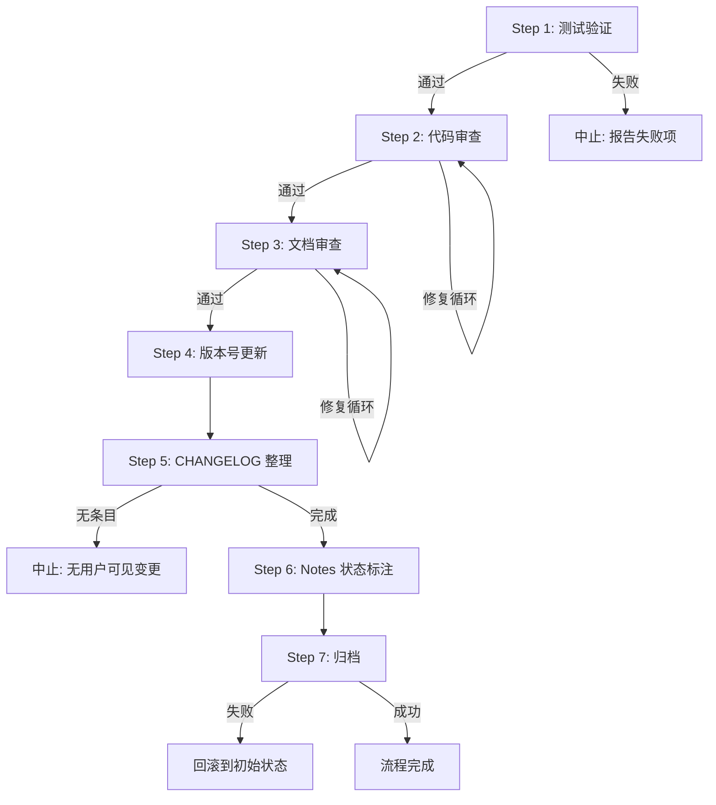
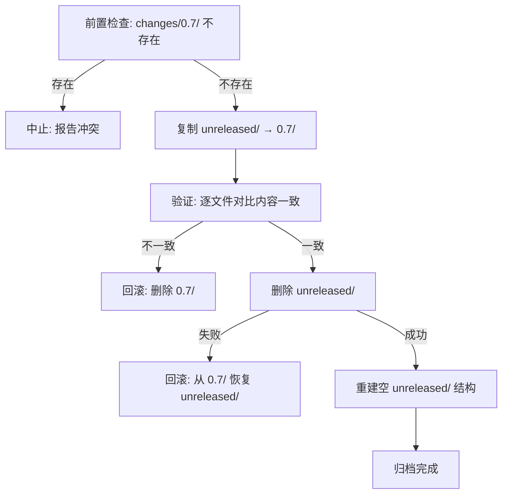

# Release 0.7.0 流程设计

---

## Overview

本设计描述 0.7.0 release 打包流程的过程架构。该流程是一条 **7 步顺序 pipeline**，由 agent 自动执行，每步有明确的前置条件、执行动作和后置验证。流程不引入新代码，仅对已有变更做验证、审查、版本标记和归档。

核心设计决策：
- **全自动执行**：代码审查和文档审查均由 agent 自主完成并修复（CR-1: A）
- **动态文档发现**：文档审查范围通过扫描 `docs/state/` 目录确定（CR-2: B）
- **摘要式 CHANGELOG**：agent 重写变更条目为面向用户的摘要风格（CR-3: C）
- **事务语义归档**：copy→verify→delete 模式，失败时回滚（CR-4: C）

---

## Architecture

### Pipeline 总览



### 步骤依赖关系

| 步骤 | 前置条件 | 产出 |
|------|---------|------|
| Step 1 | 无 | 测试通过确认 |
| Step 2 | Step 1 通过 | 代码审查报告 |
| Step 3 | Step 2 完成 | 文档一致性确认 |
| Step 4 | Step 3 完成 | 版本号已更新 |
| Step 5 | Step 4 完成 | Root CHANGELOG 已写入 |
| Step 6 | Step 5 完成 | Notes 文件已标注 |
| Step 7 | Step 6 完成 | 归档完成、unreleased 重建 |

### 数据流

```
changes/unreleased/CHANGELOG.md ──→ [提取+重写] ──→ CHANGELOG.md (root)
changes/unreleased/notes/*.md ──→ [状态标注] ──→ 原地修改
changes/unreleased/ ──→ [copy] ──→ changes/0.7/
                    ──→ [verify] ──→ 内容一致性确认
                    ──→ [delete] ──→ 清除原目录
                    ──→ [rebuild] ──→ 空 changes/unreleased/ 结构
composer.json ──→ [添加 version 字段] ──→ "0.7.0"
src/Core/Application.php ──→ [替换版本参数] ──→ '0.7.0'
```

---

## Components and Interfaces

### Step 1: 测试验证

**输入**: 无（读取项目源码）
**输出**: 通过/失败状态

| 子步骤 | 命令 | 成功条件 |
|--------|------|---------|
| Unit 测试 | `./vendor/bin/phpunit` | 0 failures, 0 errors |
| E2E 测试 | `./vendor/bin/phpunit --testsuite e2e` | 0 failures, 0 errors |
| 静态分析 | `./vendor/bin/phpstan analyse src/ --level 8` | 0 errors |

**失败行为**: 输出失败项名称与错误数量，中止整个流程。

---

### Step 2: 代码审查

**输入**: release 分支与 develop 分支的 diff
**输出**: 审查报告（各审查项通过状态）

**执行流程**:
1. 获取 diff 文件列表：`git diff develop --name-only -- '*.php'`
2. 对每个文件逐一审查，审查项：
   - 代码风格与命名
   - 错误处理完整性
   - 性能问题
   - 过大文件或函数
   - 残留 TODO/FIXME/调试代码
   - Code smell
   - Compiler warning / suppress warning
   - 未使用的 import 或变量
   - 可见性合理性
   - 安全漏洞
   - 测试质量
   - 与 design.md 的一致性
3. 发现问题 → 直接修复 → 重新审查受影响文件
4. 循环直至所有文件通过

**接口**:
```
Input:  git diff develop --name-only
Output: ReviewReport { file: string, items: CheckItem[], passed: bool }[]
```

---

### Step 3: 文档审查

**输入**: `docs/state/*.md` + `docs/manual/usage.md` + `CHANGELOG.md` + `README.md`
**输出**: 文档一致性确认 / 修正列表

**文档发现**: 动态扫描 `docs/state/` 目录下所有 `.md` 文件（当前为 5 个）：
- `docs/state/architecture.md`
- `docs/state/cli-commands.md`
- `docs/state/abilities-model.md`
- `docs/state/install-behavior.md`
- `docs/state/gitignore.md`

加上固定路径：
- `docs/manual/usage.md`
- `CHANGELOG.md`（Root）
- `README.md`

**验证项**:
- CLI 命令签名与参数是否与代码一致
- Ability 目录结构与注册表路径是否正确
- Install 流程步骤是否反映当前行为
- .gitignore 规则是否与代码行为一致
- README 命令示例可正常执行
- 项目描述反映当前功能范围（含 hook ability）
- 内部交叉引用链接无死链

**修复行为**: 发现不一致时直接修正文档使其与代码对齐。

---

### Step 4: 版本号更新

**输入**: 目标版本 `0.7.0`
**输出**: 两个文件已更新

**操作**:

| 文件 | 操作 | 目标值 |
|------|------|--------|
| `composer.json` | 添加/更新 `"version"` 字段 | `"0.7.0"` |
| `src/Core/Application.php` | 替换 `new SymfonyApplication('apm', '...')` 第二参数 | `'0.7.0'` |

**验证**: 更新后 grep 确认两处值均为 `0.7.0`，且项目中不存在旧版本号 `0.6.3` 的残留引用（排除 `vendor/` 和 `CHANGELOG.md`）。

---

### Step 5: CHANGELOG 整理

**输入**: `changes/unreleased/CHANGELOG.md`
**输出**: `CHANGELOG.md`（root）新增 `## [0.7.0]` 条目

**执行流程**:
1. 读取 Unreleased CHANGELOG
2. 提取 Breaking / Removed / Added / Changed / Fixed 分类条目（排除 Specs、Proposals）
3. 若所有分类均无条目 → 中止并报告
4. Agent 将条目重写为面向用户的摘要风格
5. 以 `## [0.7.0] - YYYY-MM-DD` 格式写入 Root CHANGELOG
6. 插入位置：文件头部说明段落之后、第一个已有版本条目（`## [0.6.3]`）之前
7. 仅包含有条目的分类作为三级标题

**输出格式示例**:
```markdown
## [0.7.0] - 2026-06-15

### Breaking

- Ability 文件迁移为"源即目标"结构...

### Added

- Hook 类型 ability 支持...
```

---

### Step 6: Notes 状态标注

**输入**: 4 个 Notes 文件路径
**输出**: 文件已标注

**目标文件**:
- `changes/unreleased/notes/hook-ability.md`
- `changes/unreleased/notes/state-gap.md`
- `changes/unreleased/notes/prp001-phase2-gap.md`
- `changes/unreleased/notes/apm-init-reference.md`

**插入规则**:
1. 定位 H1 标题后的第一个空行之后、第一个 `---` 分隔线之前
2. 插入 `**状态**：已实现`，独占一行，前后各一个空行
3. 若已存在 `**状态**：` 开头的行 → 移动到规定位置并更新内容
4. 幂等：重复执行不产生变化

---

### Step 7: 归档

**输入**: `changes/unreleased/` 目录
**输出**: `changes/0.7/` 归档目录 + 空的 `changes/unreleased/` 结构

**事务语义执行流程**:



**重建的 unreleased 结构**:
```
changes/unreleased/
├── notes/.gitkeep
├── proposals/.gitkeep
├── specs/.gitkeep
└── CHANGELOG.md          # 标准模板头，无变更条目
```

**CHANGELOG.md 模板内容**:
```markdown
# Changelog (Unreleased)

面向开发者的详细变更日志。Release 时随目录 rename 为 `changes/<version>/CHANGELOG.md`。

---
```

---

## Data Models

### Version Location 结构

| 位置 | 格式 | 当前值 | 目标值 |
|------|------|--------|--------|
| `composer.json` → `version` | JSON string `"X.Y.Z"` | 不存在 | `"0.7.0"` |
| `src/Core/Application.php` → `SymfonyApplication` 构造第二参数 | PHP string `'X.Y.Z'` | `'0.6.3'` | `'0.7.0'` |

### Root CHANGELOG 格式

遵循 [Keep a Changelog](https://keepachangelog.com/) 规范：

```
# Changelog

<说明段落>

## [版本号] - YYYY-MM-DD

### Breaking
### Removed
### Added
### Changed
### Fixed

## [上一版本] - ...
```

### Notes 文件头部格式

```markdown
# <标题>

**状态**：已实现

---

<正文内容>
```

### 归档目录映射

| 源路径 | 目标路径 |
|--------|---------|
| `changes/unreleased/` | `changes/0.7/` |
| `changes/unreleased/CHANGELOG.md` | `changes/0.7/CHANGELOG.md` |
| `changes/unreleased/notes/` | `changes/0.7/notes/` |
| `changes/unreleased/proposals/` | `changes/0.7/proposals/` |
| `changes/unreleased/specs/` | `changes/0.7/specs/` |

### 审查报告结构

```
ReviewReport:
  - file: string (相对路径)
  - checks:
    - item: string (审查项名称)
    - passed: bool
    - note: string (问题描述，仅 passed=false 时)
  - allPassed: bool
```

---

## Correctness Properties

本流程为 agent 执行的过程性操作（shell 命令、文件编辑、目录操作），不涉及可用 property-based testing 验证的纯函数逻辑。以下正确性属性定义为流程执行后必须成立的不变量，通过后置验证步骤确认。

### Property 1: 测试全通过门禁

**Validates: Requirements 1.1, 1.2, 1.3, 1.4**

- **条件**: Release_Process 进入 Step 2 时
- **保证**: Unit 测试 0 failures/errors、E2E 测试 0 failures/errors、PHPStan 0 errors 三项均已确认通过
- **违反后果**: 带缺陷的代码进入 release，可能导致用户遇到运行时错误

### Property 2: 版本号一致性

**Validates: Requirements 4.1, 4.2, 4.3, 4.4**

- **条件**: Step 4 完成后
- **保证**: `composer.json` 的 `version` 字段值 === `src/Core/Application.php` 中 `SymfonyApplication` 构造第二参数值 === `"0.7.0"`，且项目中（排除 `vendor/` 和 `CHANGELOG.md`）不存在旧版本号 `0.6.3` 的残留引用
- **违反后果**: 版本号不一致导致 `apm --version` 输出与 Composer 元数据不匹配，下游工具版本检测失败

### Property 3: CHANGELOG 格式合规

**Validates: Requirements 5.1, 5.2, 5.3**

- **条件**: Step 5 完成后
- **保证**: Root CHANGELOG 包含 `## [0.7.0] - YYYY-MM-DD` 条目，位于说明段落之后、`## [0.6.3]` 之前；仅包含有内容的分类标题；日期为 ISO 8601 格式
- **违反后果**: CHANGELOG 格式不规范，用户无法快速定位版本变更

### Property 4: Notes 标注幂等性

**Validates: Requirements 6.1, 6.2, 6.4, 6.5**

- **条件**: Step 6 执行任意次数后
- **保证**: 每个 Notes 文件恰好包含一行 `**状态**：已实现`，位于 H1 标题后第一个空行之后、第一个 `---` 之前；重复执行不改变文件内容
- **违反后果**: 重复标注导致文件格式混乱，或标注位置错误影响文档可读性

### Property 5: 归档原子性

**Validates: Requirements 7.1, 7.2, 7.3, 7.4, 7.5**

- **条件**: Step 7 完成后（无论成功或失败）
- **保证**: 系统处于以下两种状态之一：(A) `changes/0.7/` 存在且内容与原 unreleased 完全一致，同时 `changes/unreleased/` 为空模板结构；(B) 系统回滚到 Step 7 开始前的状态（`changes/unreleased/` 完整存在，`changes/0.7/` 不存在）
- **违反后果**: 归档中间状态导致变更记录丢失或重复，后续 release 流程无法正常启动

### Property 6: 文档与代码一致性

**Validates: Requirements 3.1, 3.2, 3.3, 3.4**

- **条件**: Step 3 完成后
- **保证**: `docs/state/` 下所有文档和 `docs/manual/usage.md` 中描述的 CLI 命令签名、ability 路径、install 流程、.gitignore 规则均与当前代码实现一致；内部交叉引用无死链
- **违反后果**: 文档误导用户，SSOT 失去可信度

---

## Error Handling

### Step 1: 测试验证失败

| 失败场景 | 处理方式 |
|---------|---------|
| Unit 测试有 failure/error | 输出失败测试名称与数量，中止流程 |
| E2E 测试有 failure/error | 输出失败测试名称与数量，中止流程 |
| PHPStan 报告 error | 输出错误文件与数量，中止流程 |
| 命令执行超时或异常退出 | 报告异常信息，中止流程 |

### Step 2: 代码审查

| 失败场景 | 处理方式 |
|---------|---------|
| 修复引入新问题 | 重新审查受影响文件，循环修复 |
| 修复后测试不通过 | 回退修复，报告无法自动修复的问题 |

### Step 3: 文档审查

| 失败场景 | 处理方式 |
|---------|---------|
| 文档与代码不一致 | 直接修正文档 |
| 死链检测到无效引用 | 修正或移除无效链接 |
| `docs/state/` 目录为空 | 报告异常，中止流程 |

### Step 4: 版本号更新

| 失败场景 | 处理方式 |
|---------|---------|
| `composer.json` 格式异常 | 报告 JSON 解析错误，中止 |
| Application.php 中未找到版本字符串 | 报告定位失败，中止 |
| 旧版本号残留检测发现引用 | 列出残留位置，逐一修正 |

### Step 5: CHANGELOG 整理

| 失败场景 | 处理方式 |
|---------|---------|
| Unreleased CHANGELOG 无用户可见条目 | 中止并报告 |
| Root CHANGELOG 格式异常无法定位插入点 | 报告格式问题，中止 |
| 已存在 `## [0.7.0]` 条目 | 报告冲突，中止 |

### Step 6: Notes 状态标注

| 失败场景 | 处理方式 |
|---------|---------|
| Notes 文件不存在 | 报告缺失文件，跳过该文件继续处理其余 |
| 文件无 H1 标题或无 `---` 分隔线 | 在文件末尾追加标注，记录警告 |

### Step 7: 归档

| 失败场景 | 处理方式 |
|---------|---------|
| `changes/0.7/` 已存在 | 中止归档，报告冲突错误 |
| 复制过程失败 | 删除已创建的 `changes/0.7/`，保持原状 |
| 验证发现内容不一致 | 删除 `changes/0.7/`，报告不一致文件 |
| 删除 unreleased 失败 | 从 `changes/0.7/` 恢复 unreleased，删除 0.7/ |
| 重建 unreleased 结构失败 | 报告错误（此时归档已完成，影响有限） |

---

## Testing Strategy

由于本 spec 是 release 流程而非应用代码，不适用 property-based testing。验证策略基于后置条件检查和幂等性验证。

### 后置条件验证（每步完成后自动执行）

| 步骤 | 验证方法 |
|------|---------|
| Step 1 | 检查命令退出码为 0 |
| Step 2 | 对所有 diff 文件重新执行审查清单，确认全部通过 |
| Step 3 | 重新扫描文档，确认无不一致项 |
| Step 4 | `grep -r "0.7.0" composer.json src/Core/Application.php` 确认两处存在；`grep -r "0.6.3" --include="*.php" --include="*.json" --exclude-dir=vendor` 确认无残留 |
| Step 5 | 解析 Root CHANGELOG 确认 `## [0.7.0]` 条目存在且位置正确 |
| Step 6 | 对 4 个文件执行 `grep "^\*\*状态\*\*：已实现$"` 确认恰好 1 次匹配 |
| Step 7 | `diff -r changes/0.7/ <预期内容>` + 确认 unreleased 结构正确 |

### 幂等性验证

- Step 6（Notes 标注）：对已标注文件重复执行，确认文件内容不变（`md5sum` 前后一致）
- Step 7（归档）：前置检查 `changes/0.7/` 存在时直接中止，天然幂等

### 回滚验证

- Step 7 事务语义：模拟复制后验证失败场景，确认系统回到初始状态

---

## Impact Analysis

### 受影响的 State 文档

| 文档 | 影响 |
|------|------|
| `docs/state/architecture.md` | Step 3 审查可能修正过时描述 |
| `docs/state/cli-commands.md` | Step 3 审查可能补充/修正命令签名 |
| `docs/state/abilities-model.md` | Step 3 审查可能修正路径描述 |
| `docs/state/install-behavior.md` | Step 3 审查可能修正流程描述 |
| `docs/state/gitignore.md` | Step 3 审查可能修正规则描述 |
| `docs/manual/usage.md` | Step 3 审查可能修正使用示例 |

### 行为变更

| 变更 | 说明 |
|------|------|
| `apm --version` 输出 | 从 `0.6.3` 变为 `0.7.0` |
| Composer 元数据 | 新增 `version: "0.7.0"` 字段 |

### 数据模型变更

| 变更 | 说明 |
|------|------|
| `changes/` 目录结构 | 新增 `changes/0.7/` 归档目录 |
| `changes/unreleased/` | 重置为空模板结构 |
| Notes 文件 | 头部新增状态标注行 |

### 配置变更

| 文件 | 变更 |
|------|------|
| `composer.json` | 新增 `"version": "0.7.0"` 字段 |

---

## Alternatives Considered

### Alternative 1: 归档使用 `mv`（重命名）而非 copy→verify→delete

**描述**: 直接 `mv changes/unreleased changes/0.7`，然后重建 unreleased。

**拒绝原因**: `mv` 是原子操作但不可验证——如果文件系统在 mv 过程中出错（如跨设备 mv 退化为 copy+delete），可能导致数据丢失且无法检测。copy→verify→delete 模式允许在删除前确认数据完整性，符合 CR-4 的事务语义要求。

### Alternative 2: 代码审查生成报告后人工确认

**描述**: Agent 生成审查报告，等待人工确认后再修复。

**拒绝原因**: CR-1 明确选择了方案 A（全自动），人工介入会增加流程耗时且与设计决策不符。Release 分支本身可 reset，自动修复的风险可控。

### Alternative 3: CHANGELOG 原样复制而非重写

**描述**: 将 Unreleased CHANGELOG 条目原样复制到 Root CHANGELOG。

**拒绝原因**: CR-3 明确选择了方案 C（agent 重写为用户摘要风格）。Unreleased CHANGELOG 面向开发者，措辞偏技术细节；Root CHANGELOG 面向用户，需要更简洁、更关注影响的表述。


---

## Clarification Round

> 以下问题用于在进入 tasks 阶段前确认实现细节。请逐题回答。

### CR-1: 步骤间的 commit 粒度

Design 定义了 7 步 pipeline，tasks 拆分时需要确定 git commit 策略：

- **A)** 每步完成后独立 commit（7 个 commit），便于回溯和 cherry-pick
- **B)** 按逻辑分组 commit：验证类（Step 1-3）不 commit（只读操作），修改类（Step 4-7）每步一个 commit
- **C)** 全部步骤完成后一次性 commit（1 个 commit），保持 release 分支历史简洁

**A:** B — 验证类（Step 1-3）不 commit，修改类（Step 4-7）每步一个 commit

### CR-2: 代码审查发现问题时的 commit 归属

Step 2 代码审查可能修复代码问题。修复产生的变更如何处理：

- **A)** 修复作为独立 commit（message 标注 `fix: code review finding`），与 release 流程 commit 分开
- **B)** 修复合并到 Step 2 的 commit 中，不单独拆分
- **C)** 修复不 commit——仅作为 working tree 变更，最终随 release 流程一起 commit

**A:** A — 修复作为独立 commit（`fix: code review finding`）

### CR-3: Step 5 CHANGELOG 重写的审批流程

CR-3 选择了 agent 重写摘要风格。重写后是否需要人工确认：

- **A)** Agent 重写后直接写入，不等待人工确认（全自动）
- **B)** Agent 重写后输出预览，等待用户确认后再写入 Root CHANGELOG
- **C)** Agent 重写后写入，但在 PR 描述中标注"CHANGELOG 需人工复核"

**A:** A — Agent 重写后直接写入，不等待人工确认

### CR-4: 归档验证的严格程度

Step 7 copy→verify→delete 中的 verify 步骤，验证粒度如何：

- **A)** 逐文件 `diff` 对比内容完全一致（最严格，耗时较长）
- **B)** 对比文件列表 + 文件大小一致即可（快速，覆盖大部分场景）
- **C)** 对比文件列表 + 每个文件的 md5sum 一致（平衡严格性与速度）

**A:** A — 逐文件 `diff` 对比内容完全一致
