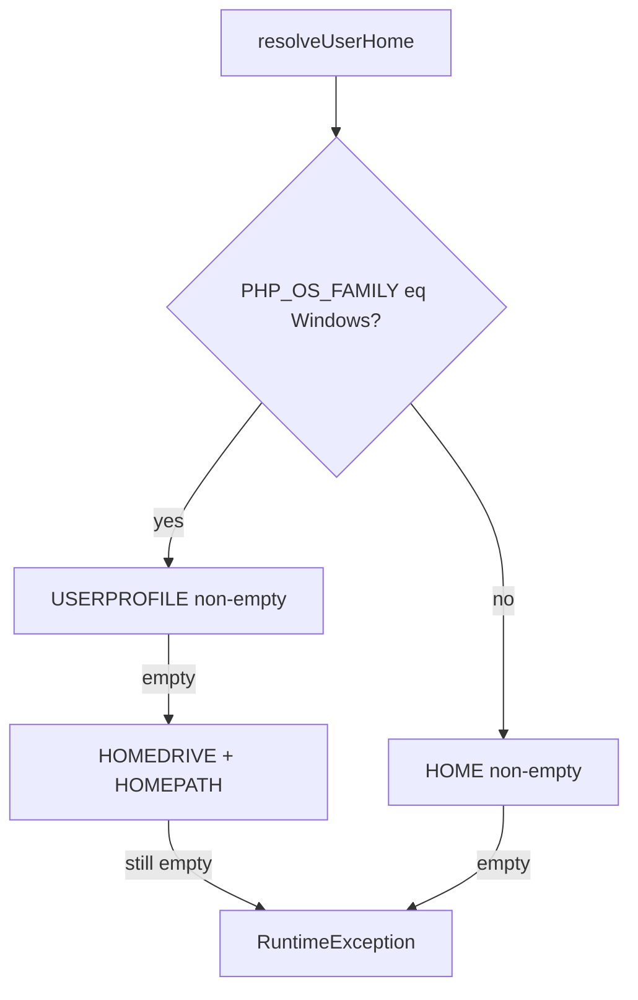

# apm Windows 支持

## Goal

在 **PowerShell + Scoop Composer** 等典型 Windows 环境（`HOME` 为空、`USERPROFILE` 已设、`COMPOSER_HOME` 指向 Scoop persist）下，`global-setup` 等 user scope 写入 `%USERPROFILE%\.cursor`，baseline/`update`/`check` 能解析 global 安装路径；文档给出可复制的安装与首装流程，**不推荐**用户设置 `HOME=%USERPROFILE%`。

## Scope

- 代码：`UserHomeResolver`；`DeployRootResolver`、`ComposerBaselineResolver` 接入 Windows 用户根与 baseline fallback。
- 文档：`docs/manual/install-windows.md`；`usage.md`、`README` 链接；`deploy-scope.md`、`install-behavior.md` SSOT。
- 不测 WSL 专篇；不改 check `--scope` 行为。

## Assumptions

- PRP-002 已声明 user scope 在 Windows 为 `%USERPROFILE%`，与 Cursor/Kiro 路径一致。
- Scoop 用户通常已设 `COMPOSER_HOME`（如 `~\scoop\persist\composer\home`）。
- CI 在 macOS/Linux；Windows 行为通过可注入 `$isWindows` 的单元测试覆盖。

## Files

| 区域 | 路径 |
|------|------|
| 新建 | `src/Service/UserHomeResolver.php`，`tests/UserHomeResolverTest.php`，`docs/manual/install-windows.md` |
| 修改 | `src/Service/DeployRootResolver.php`，`src/Service/ComposerBaselineResolver.php` |
| 测试 | `tests/DeployRootResolverTest.php`，`tests/ComposerBaselineResolverTest.php`，必要时 `tests/Service/ServiceEdgeCasesTest.php` |
| 文档 | `docs/manual/usage.md`，`README.md`，`docs/state/deploy-scope.md`，`docs/state/install-behavior.md` |
| 可选 | `.cursor/skills/apm/SKILL.md`，`changes/unreleased/CHANGELOG.md` |

## Plan

- [x] **Step 1** — `UserHomeResolver`：Windows 仅 `USERPROFILE`（空则 `HOMEDRIVE`+`HOMEPATH`），**忽略** `HOME`；Unix 用 `HOME`；构造函数可选 `?bool $isWindows` 供测试。
- [x] **Step 2** — `DeployRootResolver::userRoot()` 委托 resolver；测试 Windows 下 MSYS `HOME=/c/Users/...` 不覆盖 `USERPROFILE`。
- [x] **Step 3** — `ComposerBaselineResolver::candidateComposerHomes()`：`COMPOSER_HOME` 优先；Windows 未设时 `%APPDATA%\Composer` → `%USERPROFILE%\.composer`；Unix 保持 `~/.composer` → `~/.config/composer`。
- [x] **Step 4** — `docs/manual/install-windows.md`（Scoop、`$env:Path`、`Get-Command apm`、三阶段首装、`%USERPROFILE%\.cursor`）；链入 `usage.md`、`README`。
- [x] **Step 5** — 更新 `deploy-scope.md`、`install-behavior.md` 中 User Root 与 baseline 平台分支。
- [x] **Step 6** — `./vendor/bin/phpunit`、`./vendor/bin/phpstan analyse` 全绿。
- [x] **Step 7** — code-review、final checkpoint（可选 CHANGELOG）；完成后 `mv` 本文件至 `changes/unreleased/specs/apm-windows-support-plan.md`。

### 设计要点

**UserHomeResolver**（Deploy + Baseline 共用）：

**现状缺口**：`DeployRootResolver` 仅 `HOME`；`ComposerBaselineResolver` 无 `%APPDATA%\Composer`；state/manual 仍写 `$HOME`。

## Validation

| 项 | 方式 |
|----|------|
| User scope | Windows 测试模式：`absoluteTargetPath(user, '.cursor/...')` 在 `USERPROFILE` 下 |
| MSYS HOME | `HOME=/c/Users/foo` + `USERPROFILE=C:\Users\foo` → 后者 |
| Baseline | `COMPOSER_HOME` 优先；仅 `%APPDATA%\Composer\vendor\composer\installed.json` 可 resolve |
| 文档 | 无「推荐设置 HOME」；`$env:Path` / `Get-Command` 正确 |
| 回归 | phpunit + phpstan |

## Risks

- Git Bash 下跑 `apm` 仍走 Windows 分支，写入原生路径（与 Cursor 一致）。
- `HOMEDRIVE`+`HOMEPATH` 拼接需注意 `HOMEPATH` 前导 `\`。
- 实现前须用户确认进入 Build；**计划 SSOT 已在本文件，无需为迁计划再确认**。
